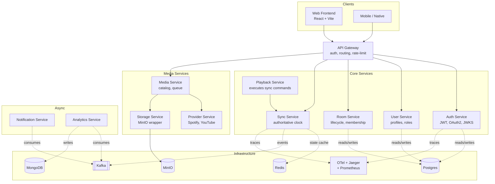
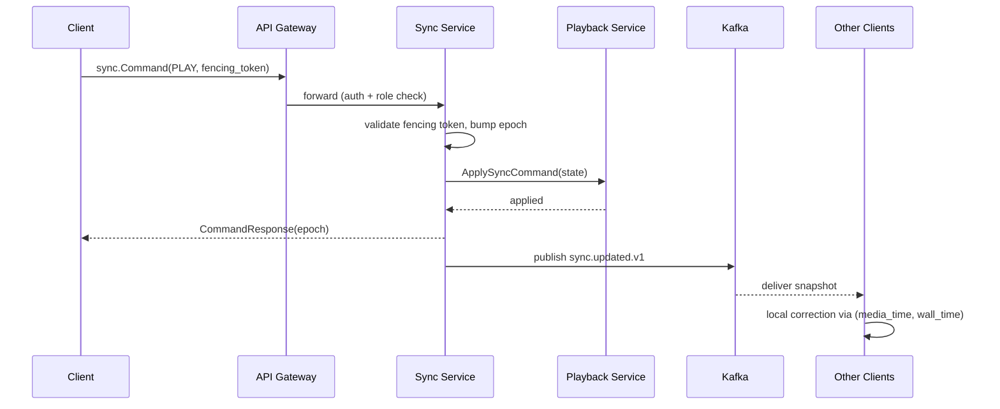

# VibeSync Architecture Overview

This document is the entry point to the system's architecture. It maps the
microservices, their data stores, and the event flow. Per-decision rationale
lives in `docs/adr/`.

## Service map (target end-state)

## Phase 1 scope

Phase 1 delivers only the foundation:

- Workspace, modules, build/test/lint tooling (ADR-0001, ADR-0002).
- All `.proto` contracts, with Auth and Sync fully specified and the rest as
  stable signatures (ADR-0003).
- Generated Go code in `/gen/go`.
- Shared libraries in `/libs` (ADR-0005, ADR-0008, ADR-0009).
- Local infrastructure stack (compose) bootable with one command.
- This documentation and the ADR trail.

**Not in Phase 1:** any `/apps/*` service binary, DB migrations, frontend,
provider integrations. Those land in their respective phases per the
Generation Order.

## Request flow example: "user presses play"

The key invariants: the Sync Service owns the epoch; clients drop frames
older than their last-applied epoch; the fencing token prevents a
partitioned old host from corrupting state.
